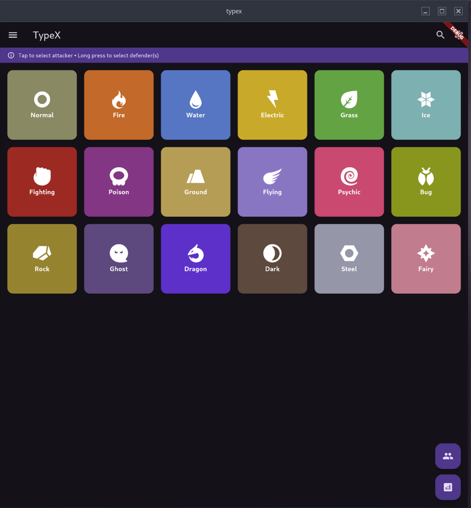
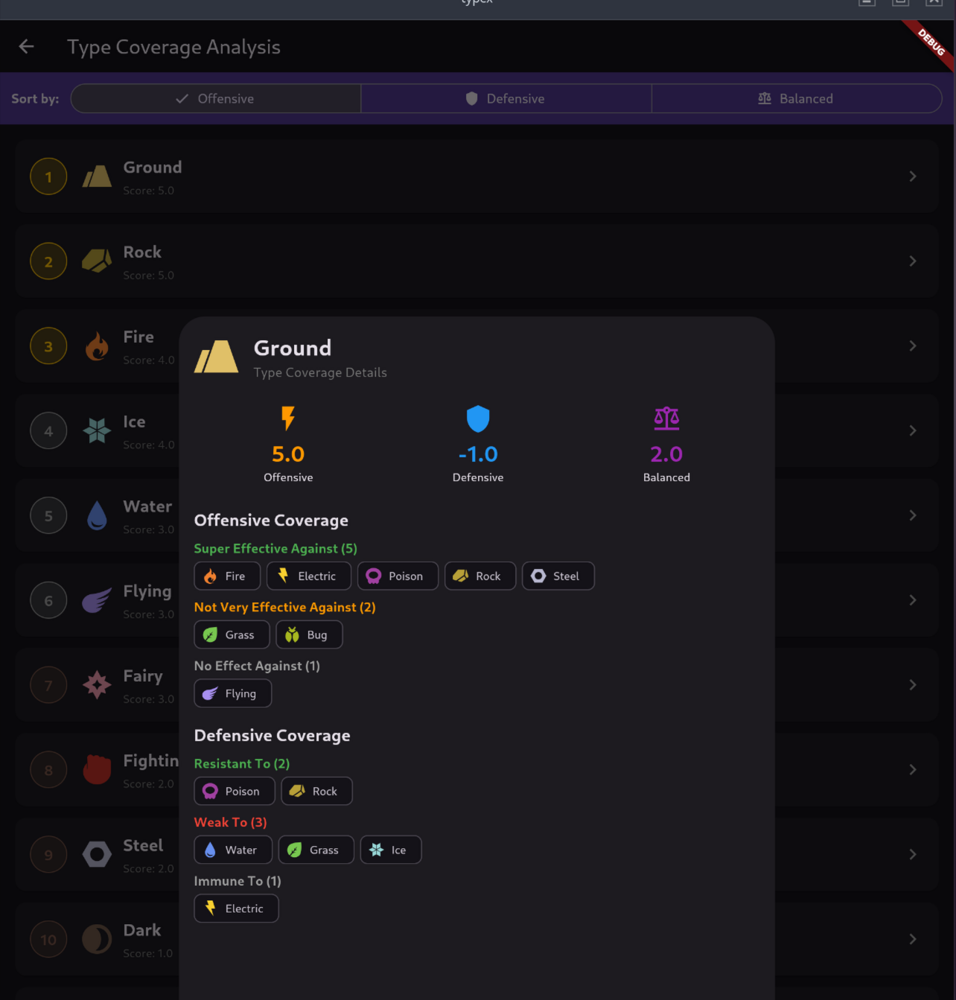
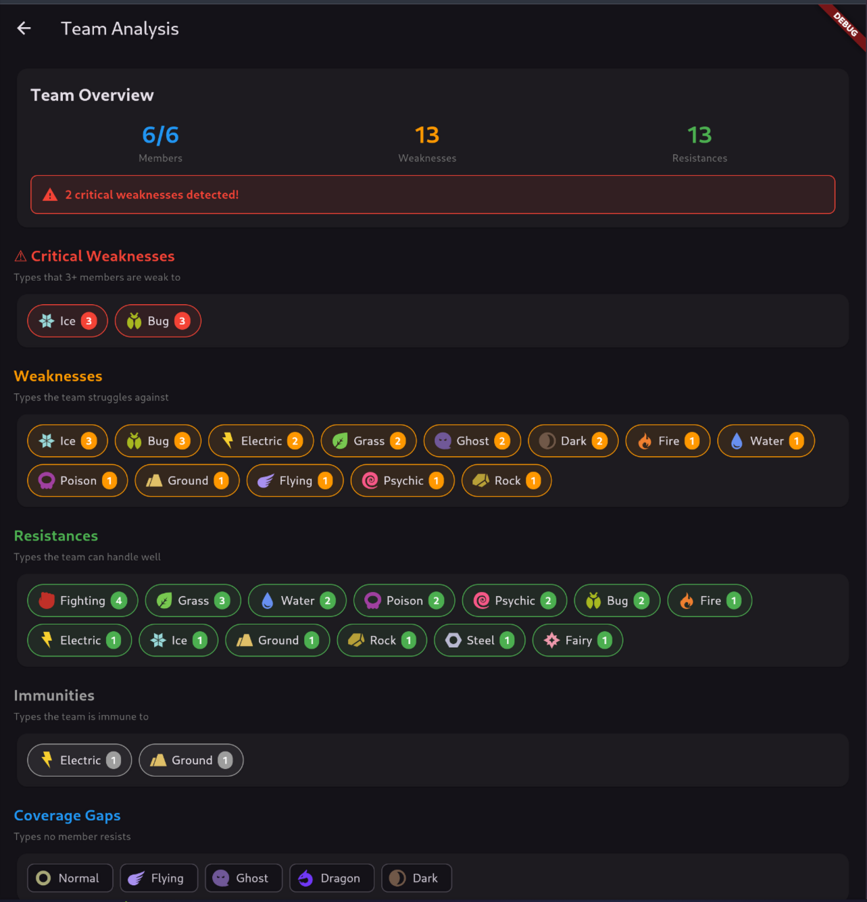

# typeX
A companion app for Pokémon type matchups.
Built with Flutter, written in Dart.

[](https://flutter.dev/)
[](https://dart.dev/)
[](https://neovim.io/)
[](#license)
[](https://claude.ai/) - AI assistant used for ideation/code help


## Overview
Typex is a mobile application designed to help Pokémon trainers understand type matchups and build effective teams
for battles. It provides a comprehensive type chart, team builder, and analysis tools to optimize your team's strengths and weaknesses.
The app is built using Flutter, ensuring a smooth and responsive experience across both Android and iOS devices.

## Features
- View type matchups for all 18 Pokemon types
- Team builder that supports up to 6 members, and offers an analysis of weaknesses
- Analysis of overall type coverage - offensive, defensive, and balanced ratings
- Dark mode support
- Responsive design for mobile and tablet devices
- Offline support - all data is stored locally
- No ads, no tracking, no analytics
- Open source - contributions welcome!

## Screenshots




## Installation
1. Ensure you have Flutter installed. Follow the instructions at [flutter.dev](https://flutter.dev/docs/get-started/install).
2. Clone this repository
    ```bash
    git clone
    ```
3. Navigate to the project directory
    ```bash
    cd typex
    ```
4. Get the dependencies
    ```bash
    flutter pub get
    ```
5. Run the app
    ```bash
    flutter run
    ```
## Usage
- Open the app on your device
- Navigate through the tabs to access the type chart, team builder, and analysis tools
- Use the team builder to add or remove Pokémon and see how it affects your team's type coverage
- Explore the type chart to understand matchups and plan your strategies

## Contributing
Contributions are welcome! Please open an issue or submit a pull request.
1. Fork the repository
2. Create a new branch
3. Make your changes
4. Submit a pull request
Please ensure your code adheres to the existing style and includes appropriate tests.

## License
This project is licensed under the MIT License. See the [LICENSE](LICENSE) file for details

## Acknowledgements
- [Flutter](https://flutter.dev/) - The framework used
- [Pokémon Database](https://pokemondb.net/) - For type data and information
- [Font Awesome](https://fontawesome.com/) - For icons used in the app
- [Google Fonts](https://fonts.google.com/) - For typography
- [Dart Packages](https://pub.dev/) - For various Dart packages used in the project
